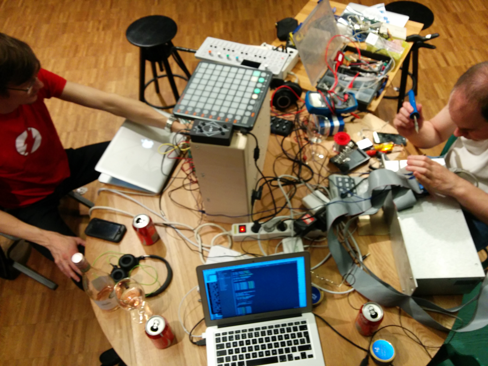

# MIDI Hack

Our project is a tribute to Ada Lovelave, credited with being the first computer programmer

Based on Ada's description of her self as a poetical science we've built an tribute that interprets Ada in an era of digital using analog interfaces.

Our MIDI Hack converts a digitized image of Ada, which is translated into a protocol that communicates with the Automan CV-96 interface over USB using node.js. This CV data is then played by a eurorack modular synth. As a bonus feature the analog CV data is converted back to digital data in form of MIDI and sent into Ableton Live where it is triggering a sample of an acoustic piano once owned by Ada Lovelace.

Team Members

* Pelle Gunnerfeldt
* Christian Portin Hemmingsson
* Andrey Zhukov
* Johan Nilsson

--

With a team from different disciplines – musicians, hackers, & electronic engineers – we plan to explore what happens with the expression when analog human input converts to digital data and then back to analog control signals.

---

Feed it with raw image data.

    convert ada.jpg -depth 16 rgb:ada-rgb.raw
